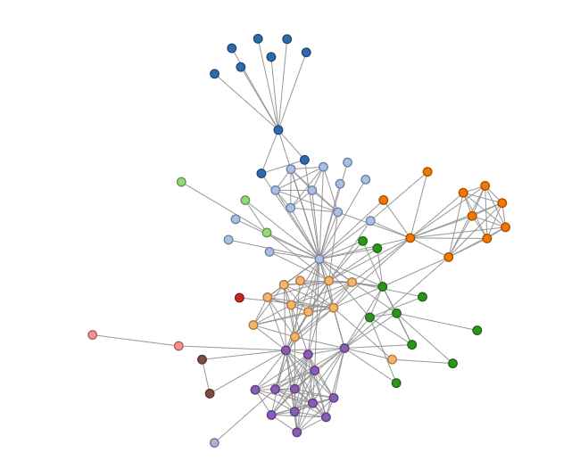

# d3_responsive_templates
Collection of simple D3 templates with data served by flask (python 2.7)

### Author: aflaisler (Aymeric Flaisler)


## EXAMPLE USAGE

### From bash:

```bash
$ python app.py
```
This start a flask server on your localhost, with the links to the different graphs.

## dynamic graph


## dynamic tree


## interpolate


## single_line (responsive)

